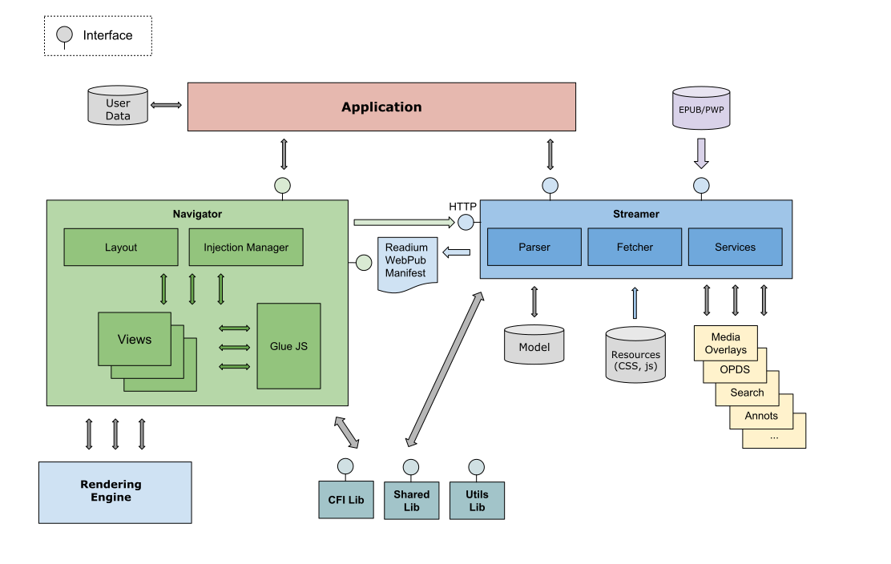

# Readium Architecture

All Readium implementations (mobile, desktop or Web) are split in two main modules, which use the [Readium Web Publication Manifest](https://readium.org/webpub-manifest/) and HTTP for exchanging data.

The "[streamer](streamer)" is responsible for parsing publications and exposing them using both an in-memory model and HTTP.

The "[navigator](navigator)" is meant to navigate in the resources of a publication and can adopt very different strategy based on the nature of the publication (ebooks, audiobooks and comics).

These modules are not necessarily meant to be deployed on the same device or written in the same language, which lets developers select the best implementation based on their requirements.

## Components

### Models

* [Web Publication Manifest](https://github.com/readium/webpub-manifest)
* [Locators](locators)

### Main Modules

* [Streamer](streamer)
* [Navigator](navigator)
* [Readium CSS](https://github.com/readium/readium-css)

### Services

* [Location Resolver](locators/resolver.md)
* [Media Overlay](media-overlay)
* [Positions List](positions)
* [Search](search)

## Projects

[See all active projects](projects) based on the Readium Architecture.
