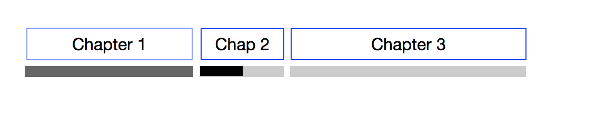
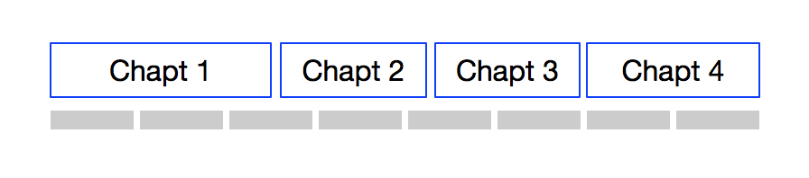

This page describes all functions that take Locator.s as parameters or return Locator.s. 
It also details some algorithms related to Locator.s.

# Loading bookmarks, annotations, page lists from the database 

## Get Bookmarks

Returns an array of Locator objects from the database, where each Locator object references a bookmark. Each Locator object contains all available location keys.

The function takes as an optional argument the URI of a resource in the publication.  

## Get Annotations

Returns an array of Locator objects from the database, where each Locator object references an annotation. Each Locator object contains all available location keys.

The function takes as an optional argument the URI of a resource in the publication. 

## Get Printed Page List

The term "page" refers here to the notion of printed page, as optionally specified in an EPUB publication.

Returns an array of Locator objects, where each Locator object references a printed page. Each Locator object contains all available location keys.

# Playing with the current location

## Get Current Locator (where am I?)

This function returns a Locator object corresponding to the current position in the publication, where all available location keys are set.

## Go To Locator

This function moves the user to the position in the publication corresponding to the Locator indicated as an argument.

# Playing with arrays of Locators

## Add Locator

This function is used when a bookmark or annotation is added to the corresponding list. 

The function takes as a parameter a Locator object and an array of Locators (bookmarks or annotations). 

A Locator object is not added twice into the list. This can only be tested if a) the same spine index is already present and no location is set (CBZ/audiobooks use case) b) the exact same location (spine index, id, cfi, css and progression) is found in the list.  

The new Locator is completed with missing locations (e.g. if the locator is inserted with a cfi only, the corresponding progression, location, fragment id and css selector are computed by the function). 

The new Locator is then inserted in the proper order in the array, and saved into the database.

## Delete Locator

This function is used when a bookmark or annotation is deleted from the corresponding list. 

The function takes as a parameter the index of the Locator object in the array of Locators, and the array itself. 

# PLying with Synthetic Pages

The term "page" refers here to the notion of synthetic page in the current resource.

## Calculate the Page List

The function takes as an optional argument the URI of a resource in the publication. If the resource URI is nil, the function returns information about every synthetic page of the publication. If the resource URI corresponds to an existing resource in the publication, the function only returns information about this resource. 

Returns an array of Locator objects, where each Locator object references a synthetic page. Each Locator object contains all available location keys (position, progression ... see below how to calculate these).

## Test Bookmarks in a Page

This function is used for checking if a bookmark icon should be activated in the current page, and for checking which bookmarks should be deleted when the user chooses to remove bookmarks from a page.

The function takes as arguments the number of pages in the current resource, the current page number in the resource and the array of Locator objects representing bookmarks in the resource. 

A page may contain two bookmarks (or more) if they were set with different user settings or device characteristics. The function therefore returns an array containing the indices of all Locator objects that fits the page, or an empty array if no Locator fits. 

# Algorithms

## Testing Bookmarks in a Page

The app is aware of the current page number and the number of pages in the current resource. It easily gets the list of bookmarks in the resource via Get Bookmarks. 

The function transforms each progression in the list of bookmarks to a page reference, via int(bookmark-progression * number-of-pages)+1 (page numbers start at 1).

It returns the array of bookmark Locators for which the page reference is equal to the current page number. 

A simple example: Let's take a resource with 10 synthetic pages (1 to 10). We are on page 4. Bookmark progressions in the resource are [15.111%, 17.222%, 35.333%, 50.444%]. It is clear that the only bookmark in the page is the third. 

# Calculating the current Progression 

For image based and pre-paginated publications, each Locator simply points to the resource (by its spine index) without any additional expression of a progression.

For other types of publications, to calculate the current progression, the service currently (July 2018) simply divides the current scroll position in the rendered resource (in pixels) by the total height of the resource (in pixels). This is not the best long term solution, because it is impossible to calculate this value without rendering the resource and using this information as unique source of the progression value; therefore calculating a progression from e.g. a cfi is impossible.

A better solution seems in practice to use the number of characters from the start of the resource to the current location, divided by the total number of characters in the resource. This does not take into account images and videos, but will be more reliable for resources that are not rendered. 

# Calculating the current Position 

For image based and pre-paginated publications, each Locator simply points to the resource (by its spine index) without any additional expression of a position.

For other types of publications, to calculate the current position, the service should consider that each segment of the resource contains 1024 _characters_ (not bytes); 1024 is arbitrary but matches what RMSDK is using. Therefore the current position corresponds to the current character offset divided by 1024, + one (for getting 1 based positions). 

Note: A segment (i.e the interval between two adjacent positions) does not cross the boundaries of a resource, therefore the size of the last segment of a resource may be less than 1024 characters; an advantage of resource based segments (beside the simplicity of calculation of the current segment) being that chapters usually correspond to resources, therefore the start of a chapter usually corresponds to a new segment. 

# Calculating the current cfi 

# Calculating the current css selector 

# Calculating the current fragment identifier 

# Getting the most relevant title to be associated with a Locator

EPUB publications are required to have a ToC, and we'll describe how we can use it to find the most relevant title for a certain Locator. Other formats (e.g. CBZ, audiobooks) don't have such navigation info, and we'll see which fallback mechanism can be used then.

## The EPUB use case
Most of the time, chapters of an ebook correspond 1 to 1 to spine items in the EPUB file. In such a case the hyperlinks of the navigation document simply point to the corresponding resources in the package.

But the ToC may be more precise than a simple list of chapters, and contain hierarchical information (i.e. subsections). Usually, in such a case, the hyperlinks of the navigation document point to identified anchors in resources, which are set on proper headings in the content.

And nothing stops an author to decide that the ToC of a publication does not follow its physical structure:

This is clearly the case in many pre-paginated ebooks, where headings are placed corresponding to their paper sibling.

Using HTML 5 outlining algorithm will be of no use in that case, as most resources in which annotations may be set will have to embedded HTML headers. 

Note also that in some cases, the targets of the navigation hyperlinks are not proper html headings, because of a lack of semantic structure in the HTML content. 

In order to select the most relevant title associated with a Locator, we can select the first section in the ToC that precedes the Locator. Progression indicators may not be sufficiently precise for that purpose (if based on scrollX), therefore this should be achieved using CFIs.  If a Locator has its CFI location value set, finding the section which is "just before" this Locator becomes easy. The title of this section will be associated to the Locator. 

Therefore, let's imagine we have set a bookmark in an ebook; the first step is to calculate a progression value. A second step will be to calculate the best corresponding CFI value, using a setCFIFromProgression() function. A third step will be to find in the ToC (expressed in memory as a tree of Locators) the Locator which is "just before" the bookmark and copy its title to the bookmark Locator. 

## The CBZ / audiobook use case

A ToC can be generated from the structural information of the publication. The headings (titles) are the names of the content files, and the in-memory ToC has a stucture identical to the one we just described in the EPUB use case. 