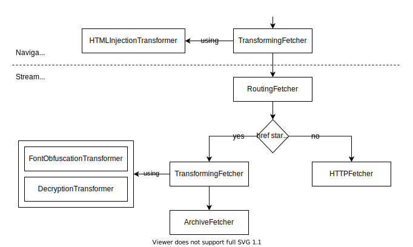

# Composite Fetcher API

* Authors: [Mickaël Menu](https://github.com/mickael-menu), [Quentin Gliosca](https://github.com/qnga)
* Related Issues:
  * [Revamping the Content Filter architecture (architecture/103)](https://github.com/readium/architecture/issues/103)
  * [Clarify and refine the streamer API on mobile platforms (architecture/116)](https://github.com/readium/architecture/issues/116)
  * [Making the ContentFilter API public (r2-streamer-kotlin/92)](https://github.com/readium/r2-streamer-kotlin/issues/92)


## Summary

The goal of this proposal is to make the fetcher more flexible using a [composite design pattern](https://en.wikipedia.org/wiki/Composite_pattern). We will introduce several `Fetcher` implementations to answer different needs, such as resource transformation and caching.


## Motivation

The `Fetcher` component provides access to a publication's resource. Therefore, it's a place of choice to offer extensibility for reading apps. With a composite pattern, we can decorate the fetcher to add custom behaviors.

This will also lead to smaller, more focused implementations that are easier to unit test.

### Location in the Toolkit

While historically the _fetcher_ was part of the _streamer_ component, this proposal requires to have it in _shared_, to be able to create fetchers from the streamers, navigators and the OPDS libraries.

However, even though the streamer doesn't contain the implementation of `Fetcher` anymore, it is still responsible to assemble the composite fetcher structure for each kind of publication.

## Developer Guide

Publication resources are accessed using a root `Fetcher` object, which can be composed of sub-fetchers organized in a composite tree structure. Each `Fetcher` node takes on a particular responsibility, with:

* **Leaf fetchers** handling low-level access, e.g. ZIP or file system.
* **Parent composite fetchers** handling routing and transformation of resources.

### Accessing a Resource

You will never need to use the `Fetcher` API directly, which is a private detail of `Publication`. To read a resource, use `Publication::get()` which will delegate to the internal root `Fetcher`.

`Publication::get()` returns a `Resource` object, which is a proxy interface to the actual resource. The content is fetched lazily in `Resource`, for performance and medium limitation reasons (e.g. HTTP). Therefore, `Publication::get()` *always* returns a `Resource`, even if the resource doesn't actually exist. Errors are handled at the `Resource` level.

```swift
let resource = publication.get("/manifest.json")

switch resource.readAsString() {
case .success(let content):
    let manifest = Manifest(jsonString: content)

case .failure(let error):
    print("An error occurred: \(error)")
}
```

### Customizing The Root Fetcher

Fetcher trees are created by the parsers, such as `r2-streamer` and `r2-opds`, when constructing the `Publication` object. However, you may want to decorate the root fetcher to modify its behavior by:

* Transforming resources (formerly known as `ContentFilter`).
* Routing some requests to different sources.
* Caching remote resources for offline access.
* Logging access.

While the composition of the fetcher tree is private, you can wrap the tree in a custom root fetcher, either by:

* Overriding the default parser configuration, for general cases.
* Making a copy of the `Publication` object with a customized `Fetcher`, for on-the-fly temporary cases. For example, to pre-process resources in a background indexing task.

```swift
func prepareForIndexing(resource: Resource) -> Resource {
    // ...
}

// The `manifest` and `fetcher` parameters are passed by reference, to be able to overwrite them.
let indexingPublication = publication.copy { inout manifest, inout fetcher in
    fetcher = TransformingFetcher(fetcher, transformer: prepareForIndexing)
}
```

### Backward Compatibility and Migration

#### Mobile (Swift & Kotlin)

This proposal is a non-breaking change, since it describes a structure that is mostly internal. The public features are new, such as adding resource transformers and decorating resource access.


## Reference Guide

*The following `Fetcher` implementations are here only to draft use cases, so they should be implemented only when actually needed.*

* [Examples of `Fetcher` Trees](#examples-of-fetcher-trees)
* [`Fetcher` Interface](#fetcher-interface)
* [`Resource` Interface](#resource-interface)
* Leaf Fetchers
  * [`FileFetcher`](#filefetcher-class)
  * [`HTTPFetcher`](#httpfetcher-class)
  * [`ZIPFetcher`](#zipfetcher-class)
  * [`ProxyFetcher`](#proxyfetcher-class)
* Composite Fetchers
  * [`RoutingFetcher`](#routingfetcher-class)
  * [`TransformingFetcher`](#transformingfetcher-class)
  * [`CachingFetcher`](#cachingfetcher-class)

### Examples of `Fetcher` Trees

The fetcher tree created by the publication parsers can be adapted to fit the characteristics of each format.

#### CBZ and ZAB (Zipped Audio Book)

These formats are very simple, we just need to access the ZIP entries.


#### Audiobook Manifest

The resources of a remote audiobook are fetched with HTTP requests, using an `HTTPFetcher`. However, we can implement an offline cache by wrapping the fetcher in a `CachingFetcher`.


#### LCP Protected Package (Audiobook, LCPDF, etc.)

The resources of a publication protected with LCP need to be decrypted. For that, we're using a `DecryptionTransformer` embedded in a `TransformingFetcher`. Any remote resources declared in the manifest are fetched using an `HTTPFetcher`.


#### EPUB

The EPUB fetcher is one of the most complex:
* An `HTTPFetcher` is used for [remote resources](https://www.w3.org/publishing/epub3/epub-spec.html#sec-resource-locations).
* The resources are transformed at two different levels:
  * in the *streamer*, to decrypt the content and deobfuscate fonts,
  * in the *navigator*, to inject the CSS and JavaScript necessary for rendering.



### `Fetcher` Interface

Provides access to a `Resource` from a `Link`.

#### Methods

* `get(link: Link, parameters: Map<String, String> = {}) -> Resource`
  * Returns the `Resource` at the given `Link.href`.
    * A `Resource` is *always* returned, since for some cases we can't know if it exists before actually fetching it, such as HTTP. Therefore, errors are handled at the `Resource` level.
  * `link: Link`
    * Link targeting the resource.
    * We're expecting a `Link` because a `Fetcher` might use its properties, e.g. to transform the resource. Therefore, `Publication::get()` makes sure that a complete `Link` is always provided to the `Fetcher`.
  * `parameters: Map<String, String> = {}`
    * HREF parameters that the source will understand, such as:
      * when `Link::href` is templated,
      * to append additional query parameters to an HTTP request.
    * The parameters are expected to be percent-decoded.
* `close()`
  * Closes any opened file handles, removes temporary files, etc.

### `Resource` Interface

Acts as a proxy to an actual resource by handling read access.

`Resource` caches the content lazily to optimize access to multiple properties, e.g. `length`, `read()`, etc.

Every failable API returns a `Result<T, Resource.Error>` containing either the value, or a `Resource.Error` enum with the following cases:

* `NotFound` equivalent to a 404 HTTP error.
* `Forbidden` equivalent to a 403 HTTP error.
  * This can be returned when trying to read a resource protected with a DRM that is not unlocked.
* `Unavailable` equivalent to a 503 HTTP error.
  * Used when the source can't be reached, e.g. no Internet connection, or an issue with the file system.
  * Usually this is a temporary error.
* `Other(Exception)` for any other error, such as HTTP 500.

#### Properties

* `link: Link`
  * The link from which the resource was retrieved.
  * It might be modified by the `Resource` to include additional metadata, e.g. the `Content-Type` HTTP header in `Link::type`.
  * Link extensibility can be used to add extra metadata, for example:
    * A `ZIPFetcher` might add a `compressedLength` property which could then be used by the `PositionsService` [to address this issue](https://github.com/readium/architecture/issues/123).
    * Something equivalent to the `Cache-Control` HTTP header could be used to customize the behavior of a parent `CachingFetcher` for a given resource.
* (lazy) `length: Result<Long, Resource.Error>`
  * Data length from metadata if available, or calculated from reading the bytes otherwise.
  * **Warning:** This API should never be called from the UI thread. An assertion will check this.
  * This value must be treated as a hint, as it might not reflect the actual bytes length. To get the real length, you need to read the whole resource.

#### Methods

* `read(range: Range<Long>? = null) -> Result<ByteArray, Resource.Error>`
  * Reads the bytes at the given `range`.
  * **Warning:** This API should never be called from the UI thread. An assertion will check this.
  * `range: Range<Long>? = null`
    * When `range` is `null`, the whole content is returned.
    * Out-of-range indexes are clamped to the available length automatically.
  * The result may be cached for subsequent accesses.
* `readAsString(encoding: Encoding? = null) -> Result<String, Resource.Error>`
  * Reads the full content as a `String`.
  * **Warning:** This API should never be called from the UI thread. An assertion will check this.
  * `encoding: Encoding? = null`
    * Encoding used to decode the bytes.
    * If `null`, then it is parsed from the `charset` parameter of `link.type` using `MediaType::parameters`, and falls back on UTF-8.
* `close()`
  * Closes any opened file handles.
  * **Warning:** This API should never be called from the UI thread. An assertion will check this.

#### Implementations

* `StringResource(link: Link, string: String)`
  * Creates a `Resource` serving a string.
* `BytesResource(link: Link, bytes: ByteArray)`
  * Creates a `Resource` serving an array of bytes.
* `FailureResource(link: Link, error: Resource.Error)`
  * Creates a `Resource` that will always return the given error.

#### `Resource.Transformer` Function Type

```kotlin
typealias Resource.Transformer = (Resource) -> Resource
```

Implements the transformation of a `Resource`. It can be used, for example, to:

* decrypt,
* deobfuscate,
* inject CSS or JavaScript,
* correct content – e.g. adding a missing `dir="rtl"` in an HTML document,
* pre-process – e.g. before indexing a publication's content.

If the transformation doesn't apply, simply return `resource` unchanged.

### Leaf Fetchers

A leaf fetcher is an implementation of `Fetcher` handling the actual low-level bytes access. It doesn't delegate to any other `Fetcher`.

#### `FileFetcher` Class

Provides access to resources on the local file system.

* `FileFetcher(paths: [String: String])`
  * `paths: [String: String]`
    * Map of reachable local paths, indexed by the exposed `href`.
    * Sub-paths are reachable as well, to be able to access a whole directory.
* `FileFetcher(href: String, path: String)`
  * Alias to `FileFetcher(paths: [href: path])`

#### `HTTPFetcher` Class

Provides access to resources served by an HTTP server.

* `HTTPFetcher(client: HTTPClient = R2HTTPClient())`
  * `client: HTTPClient`
    * HTTP service that will perform the requests.
    * Interface to be determined in another proposal.
    * Readium should provide a default implementation using the native HTTP APIs.

#### `ZIPFetcher` Class

Provides access to entries of a ZIP archive.

`ZIPFetcher` is responsible for the archive lifecycle, and should close it when `Fetcher.close()` is called. If a `Resource` tries to access a ZIP entry after the archive was closed, the `Resource.Error.Unavailable` can be returned.

* `ZIPFetcher(path: String, password: String? = null)`
  * `path: String`
    * Local path to the ZIP archive on the file system.
  * `password: String?`
    * Password used to unlock the ZIP archive if it's protected.
    * An `IncorrectPassword` error should be returned when trying to open a protected ZIP file, if the provided password is wrong.

#### `ProxyFetcher` Class

Delegates the creation of a `Resource` to a closure.

* `ProxyFetcher(closure: (Link) -> Resource)`
  * Creates a `ProxyFetcher` that will call `closure` when asked for a resource.
* `ProxyFetcher(closure: (Link) -> String)`
  * Convenient way to create a `Resource` from a string.
  * Equivalent to `ProxyFetcher({ link -> StringResource(link, closure(link))})`

### Composite Fetchers

A composite fetcher is delegating requests to sub-fetchers.

**Warning:** Make sure to forward the `Fetcher.close()` calls to child fetchers.

#### `RoutingFetcher` Class

Routes requests to child fetchers, depending on a provided predicate.

This can be used for example to serve a publication containing both local and remote resources, and more generally to concatenate different content sources.

* `RoutingFetcher(routes: List<RoutingFetcher.Route>)`
  * Creates a `RoutingFetcher` from a list of routes, which will be tested in the given order.
* `RoutingFetcher(local: Fetcher, remote: Fetcher)`
  * Will route requests to `local` if the `Link::href` starts with `/`, otherwise to `remote`.

##### `RoutingFetcher.Route` Class

Holds a child fetcher and the predicate used to determine if it can answer a request.

Both the `fetcher` and `accepts` properties are public.

* `RoutingFetcher.Route(fetcher: Fetcher, accepts: (Link) -> Bool = { true })`
  * The default value for `accepts` means that the fetcher will accept any link.

#### `TransformingFetcher` Class

Transforms the resources' content of a child fetcher using a list of `Resource.Transformer` functions.

* `TransformingFetcher(fetcher: Fetcher, transformers: List<Resource.Transformer>)`
  * Creates a `TransformingFetcher` from a child `fetcher` and a list of `transformers` to apply in the given order.
* `TransformingFetcher(fetcher: Fetcher, transformer: Resource.Transformer)`
  * Equivalent to `TransformingFetcher(fetcher, [transformer])`

#### `CachingFetcher` Class

Caches resources of a child fetcher on the file system, to implement offline access.

API to be determined in its own proposal.


## Rationale and Alternatives

The first design considered was to handle HREF routing and resources caching in other Readium components, such as the *navigator*. But there are several drawbacks:

* It complexifies navigators which are already quite complicated.
* Routing makes more sense at the file format level, which navigators are not supposed to be aware of.
* Adding features such as caching at the `Publication` level, via an internal `Fetcher`, means that any component using the `Publication` will benefit from it.


## Drawbacks and Limitations

The fetcher is an optional component in the Readium architecture. Therefore, other components could bypass the features introduced by the fetcher layer, such as caching and injection.

While this might be fine in some cases, such as for an HTML WebPub, the *navigators* provided by Readium should use the fetcher as much as possible.

This issue occurs in particular when parsing a manifest containing remote URLs, which could be requested directly by some navigators. To alleviate this problem, a `PublicationServer` component could:

1. Serve the `Publication` through a local HTTP server.
2. Produce a copy of the `Publication` for the navigator, modifying the remote manifest links to use the local URLs instead.
   * By serving remote resources, the `PublicationServer` would then act as a proxy to the remote servers, and allow injection to happen through the `Fetcher` layer.
3. To go even further, a `Resource.Transformer` could replace remote URLs with local ones in the resources content itself.
   * A particularly tricky situation is to intercept the external links in a web view, because it will usually trigger the request internally. If the web view doesn't offer a native interception mechanism, then transforming links in the content itself could be a workaround.


## Future Possibilities

While `Fetcher` is used internally in `Publication`, it is not tightly coupled to it – it's only dependency is to the `Link` core model. Therefore, it could be used for other purposes.

Some types could be further specified in their own proposal:

* Caching and network policies are complex matters, and a `CachingFetcher` needs to be well thought out.
  * Pre-loading of resources and cache invalidation needs some communication with the *navigator*. Therefore, a `CachingFetcher` probably needs to be paired with a publication service.
* Some resource transformers should expose additional APIs, for example the `HTMLInjectionTransformer` might be mutable to switch scripts or to update a CSS theme.
