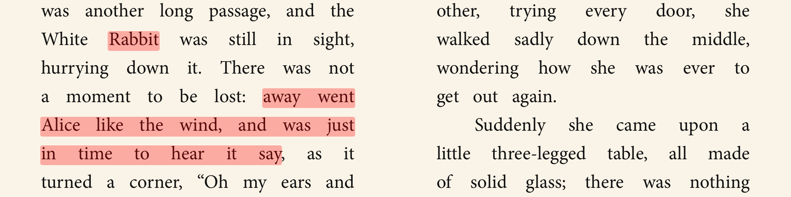
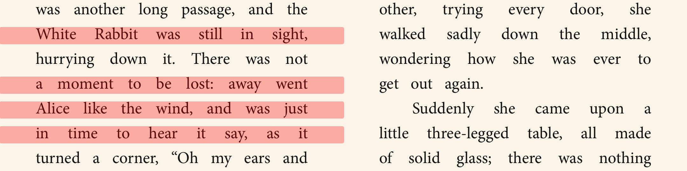
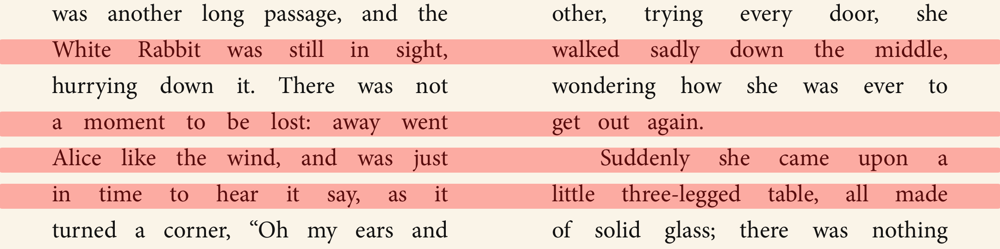

# Decorator API

* Author: [Mickaël Menu](https://github.com/mickael-menu)

## Summary

This proposal introduces a new Navigator API to draw decorations on top of publications in a media type agnostic way. This new API is a building block for higher-level features such as highlights.

## Motivation

A variety of features need to draw user interface elements (decorations) over a publication's content, such as:

* highlighting a text selection
* displaying search results
* underlining spoken text with speech synthesis
* annotating a piece of content with an icon or button
* drawing side marks in the margin

The actual rendering routines depend on the media type of the decorated resources. We can simplify reading apps significantly by providing a media type agnostic Navigator API to handle decorations.


## Developer Guide

### Terms

* **Decoration**: A single user interface element drawn on a publication.
* **Decoration group**: A set of decorations applied together. Each group is named by the developer, usually according to the feature the decorations belong to (i.e. `search`, `highlights`, `tts`).
* **Decoration style**: Determines the look and feel of a decoration once rendered by a Navigator. For example `highlight`, `underline` or `image`. It is media type agnostic.
* **Decoration template**: Translates a decoration and its style into concrete rendering instructions by the Navigator. Template implementations depend on the resource media type and the particular Navigator used.

### Creating a New Decoration

The `Decoration` object associates a location (`Locator`) in a publication with a *decoration style* to render. By relying on the media type agnostic *decoration style* to indicate its look and feel, it avoids any specific rendering instructions. This allows to reuse the same decorating code for any kind of publication or different Navigators.

Each `Decoration` object has an identifier which **must** be unique in the decoration's group. This is necessary to compute efficiently changes when applying updates. A database ID is a perfect candidate.

```swift
Decoration(
    id: "12"
    locator: Locator(...),
    style: Decoration.Style.Image(url: "http://...")
)
```

Note that a single entity might be rendered using several `Decoration` objects. For example, a highlight with a text annotation needs two `Decoration` objects: one for the actual highlight and one to draw the "text annotation" icon in the page margin.

### Applying Decorations to a Navigator

A reading app never explicitly asks the Navigator to render a decoration. Instead, the app declares the current state of the decorations for a given *decoration group* and the Navigator will decide when to render each decoration. Navigators use a diff algorithm to determine the actual changes since the last applied state to run efficient rendering instructions.

```swift
// First, fetch highlight models from your database.
let highlights = ...

// Then, create one new decoration per highlight.
let decorations = highlights.map { highlight in
    Decoration(
        id: highlight.id,
        locator: highlight.locator,
        style: Decoration.Style.Highlight(tint: highlight.color)
    )
}

// Finally, apply the decorations in the group named "user-highlights".
navigator.apply(decorations: decorations, in: "user-highlights")
```

### Registering Decoration Styles

Reading apps are welcome to register new decoration styles for custom use cases. The API depends on each Navigator, but here's an example using an HTML Navigator (e.g. for EPUB) to implement a sidemark:

```swift
// Declare a new style with associated configuration values.
extension Decoration.Style {
    class Sidemark {
        let tint: Color?
    }
}

// Create a new HTML decoration template which will be used with our new style.
let sidemarkTemplate = HTMLDecorationTemplate(
    layout: .bounds,
    width: .page,
    element: { decoration in
        let style = decoration.style as? Decoration.Style.Sidemark
        let tint = style?.tint ?? Color.red
        """
        <div><div class="sidemark" style="--tint: \(tint.cssColor)"/></div>
        """,
    },
    stylesheet: """
        .sidemark {
            float: left;
            width: 5px;
            height: 100%;
            background-color: var(--tint);
            margin-left: 20px;
            border-radius: 3px;
        }
        [dir=rtl] .sidemark {
            float: right;
            margin-left: 0px;
            margin-right: 20px;
        }
        """
)

// Associate the style with our template when creating the HTML navigator.
var config = HTMLNavigator.Configuration()
config.decorationStyles[Decoration.Style.Sidemark] = sidemarkTemplate
let navigator = HTMLNavigator(config)
```


### Checking Whether a Navigator Supports a Decoration Style

You should check whether the Navigator supports drawing the decoration styles required by a particular feature before enabling it. For example, underlining an audiobook does not make sense, so an Audiobook Navigator would not support the `underline` decoration style.

```swift
navigator.supportedDecorationStyles.contains(Decoration.Style.Underline)
```

### Backward Compatibility and Migration

#### Kotlin

The Readium Kotlin toolkit currently ships with a highlighting API. It will be deprecated in favor of the new Decorator API. The old APIs will internally use the Decorator implementation, so it will not be a breaking change.

#### Swift

The Readium Swift toolkit did not yet have decoration capabilities, so there's no impact on existing implementations.


## Reference Guide

### `DecorableNavigator` Interface

A navigator able to render arbitrary decorations.

#### Properties

* `supportedDecorationStyles: Set<Decoration.Style>`
    * List of decoration styles supported by this Navigator.
    * You should check whether the Navigator supports drawing the decoration styles required by a particular feature before enabling it. For example, underlining an audiobook does not make sense, so an Audiobook Navigator would not support the `underline` decoration style.

#### Methods

* `apply(decorations: [Decoration], group: String)`
    * Declares the current state of the decorations in the given decoration `group`.
    * Name each decoration group as you see fit. A good practice is to use the name of the feature requiring decorations, e.g. `annotation`, `search`, `tts`, etc.
    * The Navigator will decide when to actually render each decoration efficiently. Your only responsibility is to submit the updated list of decorations when there are changes.

### `Decoration` Class

A decoration is a user interface element drawn on top of a publication. It associates a style to be rendered with a precise location (`Locator`) in the publication.

For example, decorations can be used to draw highlights, images or buttons.

#### Properties

* `id: String`
    * An identifier for this decoration. It must be unique in the group the decoration is applied to.
* `locator: Locator`
    * Location in the publication where the decoration will be rendered.
* `style: Decoration.Style`
    * Declares the look and feel of the decoration.

### `Decoration.Style` Interface

The Decoration Style determines the look and feel of a decoration once rendered by a Navigator. It is media type agnostic, meaning that each Navigator will translate the style into a set of rendering instructions which makes sense for the resource type.

**Note**: This can be implemented differently depending on the platform capabilities. Ideally, this is a marker interface and each concrete type is used to identify the style.

The Readium toolkit supports two default styles:

* `Highlight(tint: Color)`
* `Underline(tint: Color)`

### Decoration Templates

Decoration Templates translate a `Decoration` object and its associated style into concrete rendering instructions specific to a Navigator and resource type. Each concrete implementation of `DecorableNavigator` can support its own kind of decoration templates.

#### `HTMLDecorationTemplate` Class

An `HTMLDecorationTemplate` renders a `Decoration` into a set of HTML elements and associated stylesheet. It is used to render decorations in EPUB publications, for example.

##### Properties

* `layout: Layout`
    * Determines the number of created HTML elements and their position relative to the matching DOM range.
    * Possible values:
        * `boxes`: One HTML element for each CSS border box (e.g. line of text). Uses JS's `Range.getClientRects()`.
        * `bounds`: A single HTML element covering the smallest region containing all CSS border boxes. Uses JS's `Range.getBoundingClientRect()`.
* `width: Width`
    * Indicates how the width of each created HTML element expands in the viewport.
    * Possible values:
        * (*default*) `wrap`: Smallest width fitting the CSS border box.
        * `bounds`: Fills the bounds layout.
        * `page`: Fills the anchor page, useful for dual page.
        * `viewport`: Fills the whole viewport.
* `element: (Decoration) -> String`
    * Closure used to generate a new HTML element for the given `Decoration`. 
    * Several elements will be created for a single decoration when using the `boxes` layout.
    * The Navigator will automatically position the created elements according to the decoration's `Locator`. The template is responsible for the look and feel of the generated elements.
* `stylesheet: String?`
    * A CSS stylesheet which will be injected in the resource, which can be referenced from the created elements.
    * Make sure to use unique identifiers for your classes and IDs to avoid conflicts with the HTML resource itself. Best practice is to prefix with your app name. `r2-` and `readium-` is reserved by the Readium toolkit.

##### Cheatsheet

| width↓&nbsp;&nbsp;layout→ | `boxes`                            | `bounds`                            |
|---------------------------|------------------------------------|-------------------------------------|
| `wrap`                    |      |      |
| `bounds`                  |    |    |
| `page`                    |      |      |
| `viewport`                |  |  |


## Future Possibilities

### Rendering Images and Text

This proposal introduces only two default styles: highlight and underline. These are useful for the main use cases of Readium: highlights, search and TTS. However, the API is generic enough to represent any kind of decorations.

In particular, reading apps might be interested in drawing images or text. Offering a generic style for such decorations could prove challenging because we need the layout, style and positioning to be flexible enough while still being media-type agnostic.

A better alternative could be to provide generic decoration templates, exploiting the characteristics of each media type. Integrators would be responsible to create new high-level decoration styles and configure the matching template for each Navigator.

#### Example: Icon in the Margin

Consider a reading app which needs to draw an icon in the page margin to show that a highlight has an associated text note.

It could create a new decoration style extending the abstract `Image` style.

```swift
class Decoration.Style.MarginIcon: Decoration.Style.Image {}
```

Then, associate this custom style with an HTML decoration template for the EPUB navigator:

```swift
decorationStyles[Decoration.Style.MarginIcon] = HTMLDecorationTemplate.Image(
    position: .topLeft,
    mask: .circle,
    size: Size(100, 100),
    margin: 20
)
```

### Media-Based Decorations

This proposal focuses on the core use case which is highlighting a text range. But the Decorator API is not limited to static or even visual decorations.

For example, we can "highlight" a portion of an audio resource by raising the volume or playing an audio cue when reaching the target time. Or display subtitles over a movie resource. Both of these examples rely on [Media Fragments](https://www.w3.org/TR/media-frags/) in the `Locator` to decorate a portion of the media.
