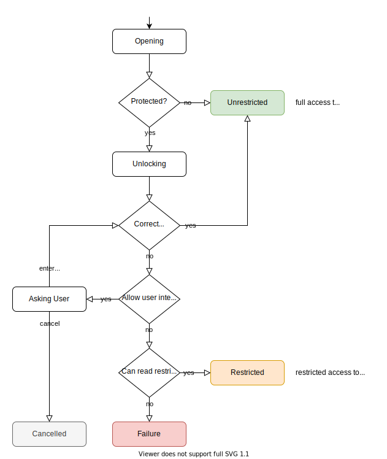

# Content Protection

* Authors: [Mickaël Menu](https://github.com/mickael-menu)


## Summary

Offers a way to support more content protection technologies in Readium 2.


## Motivation

DRMs and other protection technologies can be vastly different, therefore we don't want to make a generic system fitting the needs of every arbitrary DRM. Instead, we should only focus on the features that are actually used in Readium components, such as resource decryption and rights consumption.

We want to:

* Simplify use of DRMs in reading apps.
* Be able to support other DRMs than LCP, without modifying the toolkit itself.
* Handle decryption/transformation of publication resources.
* Consume user rights in a DRM-agnostic way, e.g. copy or print.

Peripheral features should be handled by reading apps themselves, which control the supported DRMs, for example:

* Displaying license/rights informations.
* Returning or renewing loans.


## Developer Guide

A Content Protection can be different things:

* Format-specific protections, such as [PDF permissions](https://developer.apple.com/documentation/pdfkit/pdfdocument/read_operations/permission_properties) or ZIP passwords.
* A DRM technology.
* Access restriction on resources, e.g. by requiring a Bearer Token in HTTP requests.
* Content obfuscation.

### Unlocking a Publication

Since it's usually possible to read the metadata of a publication without unlocking its protection, the credentials are not always necessary. If the provided credentials are incorrect or missing, the `Publication` can be returned in a *restricted* state: parts of its manifest are readable, but not all of its resources.

However, if you need to render the publication to the user, you can set the `allowUserInteraction` parameter to `true`. If the given credentials are incorrect, then the Content Protection will be allowed to ask the user for its credentials.

```kotlin
streamer.open(asset, allowUserInteraction = true, credentials = "open sesame")
```

Some Content Protections – e.g. ZIP encryption – prevent reading a publication's metadata even in a *restricted* state without the proper credentials. In this case, a `Publication.OpeningError.IncorrectCredentials` error will be returned.

### Using Third-Party Protections

Format-specific protections are natively handled by the Streamer, since they are tied to the asset format. However, for third-party technologies such as a DRM, you need to register them by providing a `ContentProtection` instance to the Streamer. Here's an example for LCP:

```swift
streamer = Streamer(
    contentProtections: [
        // The provided `authentication` argument is part of the LCP library
        // and is used to retrieve the user passphrase when needed.
        lcpService.contentProtection(authentication)
    ]
)
```

### Rendering a Publication

To render the publication, reading apps must first check if it is restricted. Navigators must refuse to be created with a restricted publication.

```swift
if (!publication.isRestricted) {
    presentNavigator(publication)
}
```

### Consuming User Rights

Some Content Protection technologies support user rights, such as copy or print. It's possible to consume these rights using the `UserRights` API, for example, to copy a text selection:

```swift
if (publication.rights.copy(text)) {
    pasteboard.add(text)
}
```

Sometimes, you need to know whether the *copy* action is allowed before actually consuming the right, for example to know if you can display a sharing popup. In which case, you can use `canCopy(text: String)`. For a more general purpose, the property `canCopy` indicates whether the action is at all possible and can be used to grey out a "Copy" button.

### Backward Compatibility and Migration

#### Mobile (Swift and Kotlin)

This new API is not backward-compatible with the current support for LCP and reading apps will need to update their integration.


## Reference Guide

The Readium toolkit offers different tools to address the various Content Protection technologies:

* String credentials passed during the parsing, for password protections or license unlocking.
* Resource transformers, to handle decryption and deobfuscation.
* Customizing the `Fetcher`, for access restrictions.
* A `ContentProtectionService` attached to the `Publication`, to manage user rights and hold additional DRM-specific extensions, such as a license object.

### Content Protections

Content Protections can be grouped in two categories:

* *Format-Specific Protections*, which are natively supported in the Streamer, e.g. PDF permissions and ZIP passwords.
* *Third-Party Protections*, which are managed by reading apps and registered to the Streamer, e.g. DRM and access restrictions.

Readium supports only a single enabled Content Protection per publication, because cumulating rights consumption or decryption from different sources can't be done blindly. Third-party protections provided to the Streamer take precedence (in order) over any format-specific protection.

#### Format-Specific Protections

There are currently only two format-specific protections recognized by Readium: PDF and ZIP.

When a password protection is used, the `credentials` parameter provided to the Streamer is used to unlock the protected asset. In case of incorrect credentials:

* If `allowUserInteraction` is `true`, then the `onAskCredentials()` callback provided to the Streamer is used to request the password.
* Otherwise, an `IncorrectCredentials` error is returned because format-specific protections don't support reading partial metadata.

##### ZIP Protection

There are many encryption methods supported in ZIP, some proprietary. Readium can't reasonably handle all of it, and the supported protections will depend on the underlying ZIP library used. Traditional PKWARE encryption, even though not really secure, is widely used to add password protection to a ZIP, and should therefore be supported if possible.

##### PDF Protection

PDF supports encryption protected by password and user permissions.

If a PDF contains user permissions, such as "copy", then the Streamer will expose them through a `UserRights` instance attached to the `ContentProtectionService`. Only a subset of PDF permissions are supported: the ones used in Readium. For example, the "changes allowed" permission doesn't make sense since we can't edit a PDF in Readium.

Note that Readium supports only publication-level protections. If a ZIP package contains a password-protected PDF file, then the PDF won't be readable in Readium.

#### Third-Party Protections

Third-party protections can be widely different, therefore the Readium toolkit avoids making assumptions about the way they work. This means that only the core features used in Readium – publication locking, resources transformation and rights consumption – need to be implemented with protection-agnostic interfaces. Any peripheral features, such as managing loans or presenting license information, are out of scope for Readium. They should be handled by reading apps themselves, using the APIs provided by the Content Protection library.

A third-party protection library (or bridge) should implement the `ContentProtection` interface, which will be registered to the Streamer and used when parsing a publication.

##### Unlocking a Publication

A protected publication can be opened in two states: *restricted* or *unrestricted*. A restricted publication has a limited access to its manifest and resources and can't be rendered with a Navigator. It is usually only used to import a publication to the user's bookshelf.

Readium makes no assumption about the way a third-party protection can unlock a publication. It could for example:

* fetch the credentials from a web service or an encrypted storage,
* compute it from locally available data, for example to deobfuscate resources,
* display a dialog to the user,
* start an OAuth authentication flow through a web view,
* or even, like a format-specific password protection, use the `onAskCredentials()` callback provided to the Streamer.

`ContentProtection` is allowed to prompt the user for its credentials *only* if the `allowUserInteraction` parameter is set to true. The rationale is that a reading app might want to import a collection of publications, in which case the user should not be asked for all its credentials. However, background requests are allowed at all time.

Note that if, for a given third-party protection, a restricted publication can't be used to create its `Manifest` at all, then the parsing should fail with an `IncorrectCredentials` error, like with a password-protected ZIP.



### API Reference (`r2-shared`)

#### `UserRights` Interface

Manages consumption of user rights and permissions.

##### Copy

* `canCopy: Boolean`
  * Returns whether the user is currently allowed to copy content to the pasteboard.
  * Returns `false` if the *copy* right is all consumed.
  * Navigators and reading apps can use this to know if the "Copy" action should be greyed out or not.
    * *Important: This should be called every time the "Copy" action will be displayed, because the value might change during runtime.*
* `canCopy(text: String) -> Bool`
  * Returns whether the user is allowed to copy the given `text` to the pasteboard.
  * This is more specific than the `canCopy` property, and can return `false` if the given `text` exceeds the allowed amount of characters to copy.
  * To be used before presenting, for example, a pop-up to share a selected portion of content.
* `copy(text: String) -> Bool`
  * Consumes the given text with the *copy* right.
  * Returns whether the right consumption was successful, and the caller can copy the content to the pasteboard.

##### Print

* `canPrint: Boolean`
  * Returns whether the user is currently allowed to print the content.
  * Returns `false` if the *print* right is all consumed.
  * Navigators and reading apps can use this to know if the "Print" action should be greyed out or not.
    * *Important: This should be called every time the "Print" action will be displayed, because the value might change during runtime.*
* `canPrint(pageCount: Int) -> Bool`
  * Returns whether the user is allowed to print the given amount of pages.
  * This is more specific than the `canPrint` property, and can return `false` if the given `pageCount` exceeds the allowed amount of pages to print.
  * To be used before attempting to launch a print job, for example.
* `print(pageCount: Int) -> Bool`
  * Consumes the given amount of pages with the *print* right.
  * Returns whether the right consumption was successful, and the caller can print the pages.

##### Implementations

* `UnrestrictedUserRights`
  * The default implementation used when there are no rights restrictions. Basically a "passthrough" object.
* `AllRestrictedUserRights`
  * Default implementation used for a `Publication` opened in a restricted state. It will forbid all user rights.

#### `ContentProtectionService` Interface (implements `Publication.Service`)

Provides information about a publication's content protection and manages user rights.

##### Properties

* `isRestricted: Boolean`
  * Indicates whether the `Publication` has a restricted access to its resources and can't be rendered in a Navigator.
* `error: Error?`
  * The error raised when trying to unlock the `Publication`, if any.
  * This can be used by a Content Protection to return a status error, for example if a publication is expired or revoked.
  * Reading apps should present this error to the user when attempting to render a restricted `Publication` with a Navigator.
* `credentials: String?`
  * Credentials used to unlock this `Publication`.
  * This should be provided by the Content Protection only if reading apps are allowed to store the credentials in a secure location, to reuse them in `Streamer::open()`.
  * It can be used to avoid asking for a password every time the user opens the publication, for example.
* `rights: UserRights`
  * Manages consumption of user rights and permissions.
* `name: LocalizedString?`
  * User-facing name for this Content Protection, e.g. "Readium LCP".
  * It could be used in a sentence such as `"Protected by {name}"`

##### `Publication` Helpers

* `isProtected: Boolean`
  * Indicates whether this `Publication` is protected by a Content Protection technology.
  * Checks if there's a `ContentProtectionService` attached to the `Publication`.
* `isRestricted: Boolean`
  * Fallback on `false`.
* `protectionError: Error?`
  * Fallback on `null`.
* `credentials: String?`
  * Fallback on `null`.
* `rights: UserRights`
  * Fallback on `UnrestrictedUserRights()`.
* `protectionLocalizedName: LocalizedString?`
  * Fallback on `null`.
* `protectionName: String?`
  * Gets the default translation for the protection's name.
  * Fallback on `null`.

##### Web Service

###### `content-protection` Route

* href: `/~readium/content-protection`
* type: `application/vnd.readium.content-protection+json`

```json
{
  "isRestricted": false,
  "error": {
    "en": "The publication has expired."
  },
  "name": {
    "en": "Readium LCP"
  },
  "rights": {
    "canCopy": true,
    "canPrint": false
  }
}
```

###### `rights/copy` Route

* href: `/~readium/rights/copy{?text,peek}`
  * `text` is the percent-encoded string to copy.
  * `peek` is `true` or `false`. When missing, it defaults to `false`.
* type: `application/vnd.readium.rights.copy+json`

If `peek` is true, then it's equivalent to calling `publication.rights.canCopy(...)`: the right is not consumed.

**Response**

Status Code | Description
----------- | -----------
`200` | The copy is allowed.
`403` | The copy is forbidden.

###### `rights/print` Route

* href: `/~readium/rights/print{?pageCount,peek}`
  * `pageCount` is the number of pages to print, as a positive integer.
  * `peek` is `true` or `false`. When missing, it defaults to `false`.
* type: `application/vnd.readium.rights.print+json`

If `peek` is true, then it's equivalent to calling `publication.rights.canPrint(...)`: the right is not consumed.

**Response**

Status Code | Description
----------- | -----------
`200` | The print is allowed.
`403` | The print is forbidden.

### API Reference (`r2-streamer`)

#### `Streamer` Extensions

##### `Constructor`

Two new arguments are added to the constructor: `contentProtections` and `onAskCredentials`.

* `contentProtections: List<ContentProtection> = []`
  * List of `ContentProtection` used to unlock publications.
  * Each `ContentProtection` is tested in the given order.
* `onAskCredentials: OnAskCredentialsCallback? = default`
  * Called when a content protection wants to prompt the user for its credentials.
  * This is used by ZIP and PDF password protections.
  * The default implementation of this callback presents a dialog using native components when possible.
  * `typealias OnAskCredentialsCallback = (dialog: Dialog<String>, sender: Any?, callback: (String?) -> ()) -> ()`
    * `dialog: Dialog<String>`
      * Description of the dialog to display to the user.
      * The specification of `Dialog<T>` is out of scope for this proposal.
    * `sender: Any?`
      * Free object provided by the reading app to `Streamer::open()` as context.
      * For example, it could be the source `Activity`/`ViewController` which would be used to present the dialog.
    * `callback: (String?) -> ()`
      * Closure to call once the user completes the dialog.
      * If the given credentials are null, it means the dialog was canceled without providing any credentials.

##### `Methods`

There are three new parameters added to `Streamer::open()`: `allowUserInteraction`, `credentials`, and `sender`.

* (async) `open(asset: PublicationAsset, allowUserInteraction: Boolean, credentials: String? = null, sender: Any? = null, onCreatePublication: Publication.Builder.Transform? = null, warnings: WarningLogger? = null) -> Publication`
  * `allowUserInteraction: Boolean`
    * Indicates whether the user can be prompted during opening, for example to ask their credentials.
    * This should be set to `true` when you want to render a publication in a Navigator.
    * When `false`, Content Protections are allowed to do background requests, but not to present a UI to the user.
  * `credentials: String? = null`
    * Credentials that Content Protections can use to attempt to unlock a publication, for example a password.
    * Supporting string credentials is entirely optional for Content Protections, this is only provided as a convenience.
    * The format is free-form: it can be a simple password, or a structured format such as JSON or XML.
  * `sender: Any? = null`
    * Free object that can be used by reading apps to give some context to the Content Protections.
    * For example, it could be the source `Activity`/`ViewController` which would be used to present a credentials dialog.
    * Content Protections are not supposed to use this parameter directly. Instead, it should be forwarded to the reading app if an interaction is needed.

#### `ContentProtection` Interface

Bridge between a Content Protection technology and the Readium toolkit.

Its responsibilities are to:

* Unlock a publication by returning a customized `Fetcher`.
* Create a `ContentProtectionService` publication service.

##### Methods

* (async) `open(asset: PublicationAsset, fetcher: Fetcher, allowUserInteraction: Boolean, credentials: String?, sender: Any?, onAskCredentials: OnAskCredentialsCallback?) -> ProtectedAsset?`
  * Attempts to unlock a potentially protected publication asset.
  * `fetcher: Fetcher`
    * The Streamer will create a leaf `Fetcher` for the low-level asset access (e.g. `ArchiveFetcher` for a ZIP archive), to avoid having each Content Protection open the `asset` to check if it's protected or not.
    * A publication might be protected in such a way that the package format can't be recognized, in which case the Content Protection will have the responsibility of creating a new leaf `Fetcher`.
  * Returns:
    * a `ProtectedAsset` in case of success,
    * `null` if the `asset` is not protected by this technology,
    * a `Publication.OpeningError` if the asset can't be successfully opened.

##### `ProtectedAsset` Class

Holds the result of opening a `PublicationAsset` with a `ContentProtection`.

*All the constructor parameters are public.*

* `ProtectedAsset(asset: PublicationAsset, fetcher: Fetcher, onCreatePublication: Publication.Builder.Transform?)`
  * `asset: PublicationAsset`
    * Protected publication asset which will be provided to the parsers.
    * In most cases, this will be the `asset` provided to `ContentProtection::open()`, but a Content Protection might modify it in some cases:
      * If the original asset has a media type that can't be recognized by parsers, the Content Protection must return an `asset` with the matching unprotected media type.
      * If the Content Protection technology needs to redirect the Streamer to a different asset. For example, this could be used to decrypt a publication to a temporary secure location.
  * `fetcher: Fetcher`
    * Primary leaf fetcher to be used by parsers.
    * The Content Protection can unlock resources by modifying the `Fetcher` provided to `ContentProtection::open()`, for example by:
      * Wrapping the given `fetcher` in a `TransformingFetcher` with a decryption `Resource.Transformer` function.
      * Discarding the provided `fetcher` altogether and creating a new one to handle access restrictions. For example, by creating an `HTTPFetcher` which will inject a Bearer Token in requests.
  * `onCreatePublication: Publication.Builder.Transform?`
    * Transform which will be applied on the Publication Builder before creating the Publication.
    * Can be used to add a Content Protection Service to the Publication that will be created by the Streamer.

### Extensibility for Third-Party Protections

While the presented protection features are only limited to the ones used by Readium components, the architecture is opened to third-party extensions.

#### Publication-Scoped Extensions

`ContentProtectionService` is a place of choice for extensibility, because it is attached to the `Publication` object. You can add any extra features and, optionally, expose them as *publication helpers*.

Here's an example of how to expose the license of the LCP DRM inside the `Publication`:

```swift
class LCPContentProtectionService: ContentProtectionService {

    let license: LCPLicense

}

extension Publication {

    var lcpLicense: LCPLicense? {
        findService(ContentProtectionService.self)?.license
    }

}

// Then the reading app can access the license from the `Publication` itself:
publication.lcpLicense?.renew()
```

#### Globally-Scoped Extensions

You can also add global features in your implementation of the `ContentProtection` interface. This class is instanciated by reading apps, so you have full control over the exposed API.

A common use case would be to require the reading app to implement a custom callback interface to ask the user for the credentials when requested. Here's an example with LCP:

```typescript
interface LCPAuthenticating {
    requestPassphrase(license: LCPAuthenticatedLicense): String?
}

class LCPContentProtection extends ContentProtection {
    authentication: LCPAuthenticating

    constructor(authentication: LCPAuthenticating) {
        this.authentication = authentication
    }
}
```


## Rationale and Alternatives

### Unlocking is Only Done During Parsing

Compared to the current implementation, a `Publication` is opened either unrestricted, or restricted. There's no way to unlock an existing `Publication` without reparsing it. The reasons for this choice are:

* to simplify the code in reading apps,
* to make sure the Streamer has access to all the resources it needs during parsing,
* we usually don't need to unlock a `Publication` after it's opened:
  * importing a publication usually requires *not* to ask the user for credentials, so it can stay restricted
  * rendering a publication requires it to be unrestricted

### Peripheral Features

Peripheral features were initially considered to be integrated in a DRM-agnostic interface: displaying rights information, renewing loans, etc. However, it was guided by the LCP specification, and it became clear that it wouldn't really be agnostic.

For example, LCP is limiting copy by a character count. But a DRM could restrict word count, or number of copies. Therefore, it's not easy to display localized information about the remaining *copy* right available.

Besides, these features don't live in Readium components but in reading apps. You are welcome to create your own DRM-agnostic adapter for such features.


## Future Possibilities

### Invalidating the Publication Asset

A Content Protection technology might alter the publication asset during the lifetime of the `Publication` object. For example, by injecting an updated license file after renewing a loan. This could potentially be an issue for opened file handlers in the leaf `Fetcher` accessing the publication asset.

A solution would be the introduction of an `InvalidatingFetcher`, which would be able to recreate its child `Fetcher` on-demand. The `ContentProtectionService` would keep a reference to this `InvalidatingFetcher`, and call `invalidate()` every time the publication asset is updated.

#### `InvalidatingFetcher` Class

##### Constructor

* `InvalidatingFetcher(fetcher: Fetcher, invalidate: (Fetcher) -> Fetcher)`
  * `fetcher: Fetcher`
    * Initial child fetcher to use.
  * `invalidate: (Fetcher) -> Fetcher`
    * Closure that will recreate the child fetcher when called.
    * The previous fetcher is passed as an argument.

##### Methods

* `invalidate()`
  * Invalidate the child fetcher.
  * `close()` will be called on the previous child fetcher, after calling the `invalidate` closure to create the new one.
