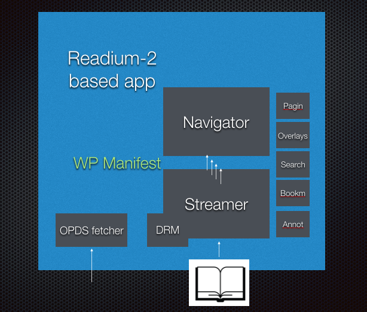

# Architecture for Readium-2 Streamer

Most Readium-2 implementations (mobile, desktop or Web app) can be divided in two parts, which may be running on different systems or written in completely different languages. 

One contains the webview and associated rendering application, let's call it the "frontend", and the other contains the EPUB parser and the associated marshaling service, that we could call the "backend". 

 

This backend is called the "streamer" in the Readium-2 architecture and it's responsible for a number of different things: parsing publications, fetching resources in them and exposing them using HTTP.

## Features of the Parser

* access EPUB files or exploded EPUBs
* parse EPUB 2.x and 3.x
* expose in-memory data model for EPUB

## Features of the Fetcher

* decrypt and deobfuscate resources contained in the EPUB container
* pre-process HTML and SVG documents

## Features of the HTTP Server
* expose to the frontend 
 * the Web Publication Manifest (JSON),
 * the Media Overlays (JSON),
 * the LCP License Document (JSON),
 * every resource from the EPUB container
 
* provide a pluggable API for other modules exposed in HTTP (search, media-overlay, locators)

## Web Publication Manifest

Initial work on the interchange format will be based on the [Web Publication Manifest](https://github.com/HadrienGardeur/webpub-manifest) with potential extensions and improvement to that draft through the following means:

* additional metadata in a new EPUB specific context document
* new collection roles (so far, mostly to cover the Navigation Document)
* new relationships
* new properties for the link object

The first implementation of the streamer (written in Go) has an in-memory model that's very close from a Web Publication Manifest:

* [publication](https://github.com/Feedbooks/webpub-streamer/blob/master/models/publication.go)
* [metadata](https://github.com/Feedbooks/webpub-streamer/blob/master/models/metadata.go)

The main difference being that the in-memory model also have a number of extension points, including:

* a generic metadata element
* additional collections

None of these extensions will show up in the JSON output (manifest).

## Fetcher

### Content Injection

On some platforms, injecting JS, CSS and links directly at a parser level will be necessary.

The following features might be necessary:

* provide a configuration file to indicate CSS and JS resources that need to be injected in all HTML resources
* support for navigator.epubReadingSystem

Injecting links to related resources could also prove to be useful:

* link to next/previous resource
* link to the manifest itself

Content injection can have a pretty big impact in terms of performance, which means that its use should be as minimal as possible.

### Decryption & Deobfuscation

For decryption, speed is the key. We need to make sure that this has minimal impact on performance which means:

* for languages that provide high performance, hardware-based optimisations, we can directly rely on native code
* for the rest, we should probably rely on C++

While most resources (HTML, images, JS and CSS) should not be too difficult to decrypt, larger resources such as video and audio files require partial decryption, right in the middle of the resource.

This is by far the trickiest part of the fetcher, and will require a per platform approach to be handled properly.

## HTTP Server

### Caching

Purely in terms of speed, caching can provide some useful and easy to implement improvements.

In the context of the streamer, using `Cache-Control` is the most efficient technique:

* after the first request, an HTTP client will keep the response in cache for a period of time that we can control
* for subsequent requests, if the cache is still valid, the response will be served directly from the cache without any additional request

If we rely on `Last-Modified` or `ETag` instead:

* after the first request, an additional request remains necessary to validate that the resource has not been modified
* calculating the `Last-Modified` or `ETag` has a performance impact on the server side

`Cache-Control` requires the usage of unique URIs per publication and resource, in order to avoid a situation where the cache would serve a resource from the wrong publication, or an older version of the same publication.

This will have an impact on how we expose resources from our publication, which will require using both a publication identifier and a modification date (based on metadata in EPUB 3.x and on a system specific timestamp for EPUB 2.x) in our URIs.

For Readium-2 streamers that will be deployed on the server side, this also means that using a CDN to serve resources from the publication is a possibility.

### Link Header

The `Link` header in HTTP enables a number of optimization, for instance pre-fetching ("prefetch") or pre-rendering ("prerender"). 

While pre-fetching is relatively harmless and should probably be turned on by default, pre-rendering is a little trickier and can also be safely handled by the HTTP server in a number of cases (a FXL EPUB for instance).

It's also relatively harmless to include references to the manifest ("manifest"), along with the next ("next") and previous ("prev") resources from the spine.

The latest versions of Chrome can also handle service workers using a HTTP link header ("serviceworker"), which could be a good option where one of the latest version of Chrome/Chromium are the target.

### HTTP/2

HTTP/2 push opens the door to a brand new world for optimization:

* should we push all non-audio/video resources when we first access a publication?
* should we push instead the next/previous item in the spine?
* can we detect the resources that will be used in an HTML/SVG document and push those?

It's also worth considering whether HTTP/2 push is necessary, since the interchange format already allows RS to pre-fetch spine items and resources.

## Plugins

Readium-2 Streamer must also provide an easy way to add and expose modules in HTTP.

To provide a good plugin architecture, we need generic APIs to:

* configure which plugins are being used
* expose additional links in the manifest
* add new routes to the HTTP server
* handle incoming requests from the HTTP server

A number of Readium-2 modules are also plugins themselves, and should rely on the same mechanism.

The current list includes:

* [Media Overlay](../media-overlay)
* [Search](../search)

## Security

> **Related issues:** Both [#17 Security aspects of using an HTTP Server](https://github.com/readium/readium-2/issues/17) and [#18 Reading System Security](https://github.com/readium/readium-2/issues/18) are relevant here.
