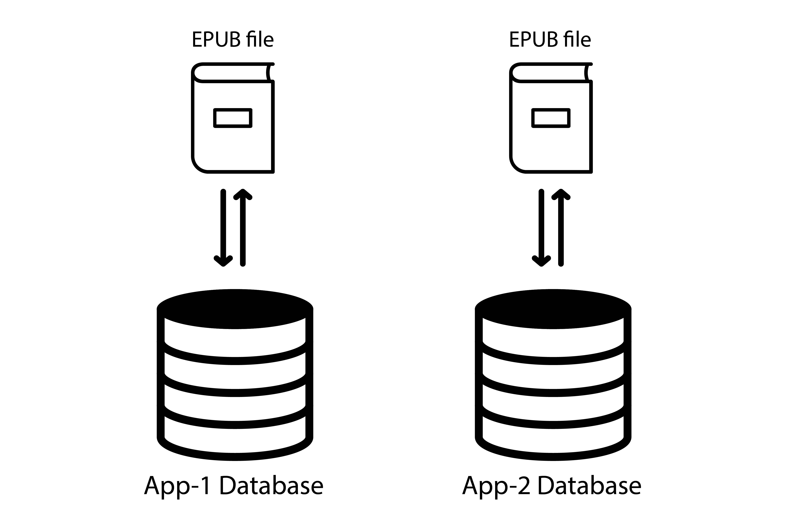
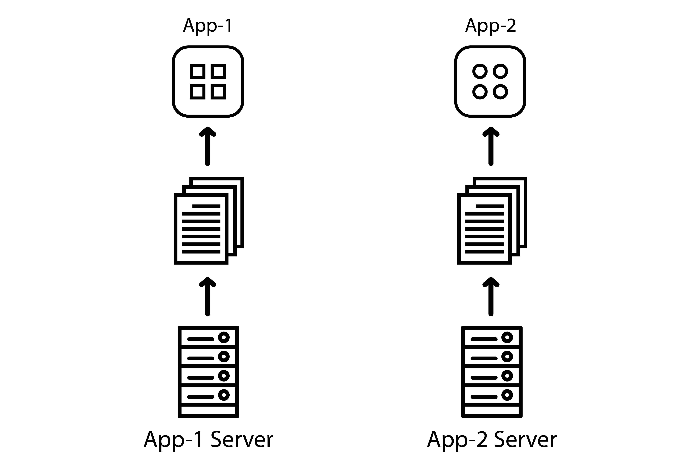
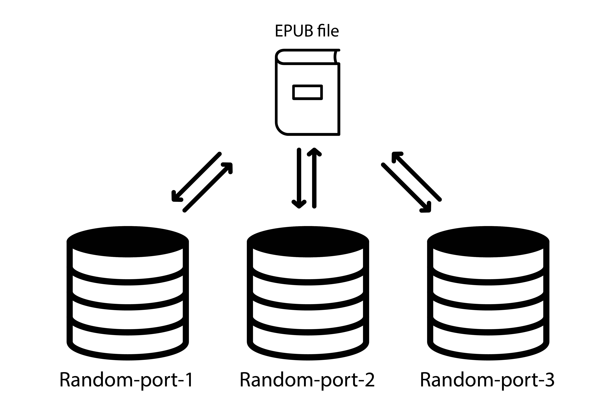

# Web Origin Explainer: Practical Issues and Possible Solutions 

Editor: Jiminy Panoz, Jellybooks

Contributors: Daniel Weck, Readium & Daisy ([r2-streamer-js doc](https://github.com/readium/r2-streamer-js/blob/develop/docs/origin.md))

**Note:** This document is a draft that will evolve over the next months. Please feel free to contact the editor if you have further details, corrections and/or want to contribute improving it.

This document aims to address the web origin issues implementers should take into account and the options to get around them. 

It is important to note that the issues discussed in this document are not hypothetical, they are reproducible with existing commercial EPUB3 publications, and raise security as well as authoring concerns.

## What is the Web Origin Concept?

As stated in [RFC6454](https://tools.ietf.org/html/rfc6454), 

> the concept of *origin* is often used as the scope of authority or privilege by user agents. Typically, user agents isolate content retrieved from different origins to prevent malicious web site operators from interfering with the operation of benign web sites. […] More specifically, user agents allow content retrieved from one origin to interact freely with other content retrieved from that origin, but user agents restrict how that content can interact with content from another origin.

In practice, this translates into the [same-origin policy](https://developer.mozilla.org/en-US/docs/Web/Security/Same-origin_policy), which is a critical mechanism at the core of the Web Security Model. This model applies to browsers and web views for example.

With EPUB, the problem is that the Reading System itself must set the origin of content, which can completely break the same-origin policy and authors’ expectations when using a JavaScript API for instance.

An origin is the following tuple:

```
protocol + host + port
```

In which:

- `protocol` can be `http` | `https` | `file` | `…`
- `host` can be `hostname` | `localhost` | `undefined`
- `port` can be `number` | `undefined`

If we apply the same origin policy, we will get the following: 

- `http://my-reader.com` and `https://my-reader.com` are different origins (different `protocol`);
- `https://my-reader.com` and `https://epubs.my-reader.com` are different origins (different `host`);
- `https://my-reader.com` and `https://my-reader.com/epubs/` are same origin (`host` is the same, only the path differs);
- `http://localhost:8080` and `http://localhost:8081` are different origins (different `port`);
- `http://localhost:8080/ebook1/Chapter1.xhtml` and `http://localhost:8080/ebook2/Chapter1.xhtml` are same origin (only the path differs).

In this last example, we can already foresee the potential issues a Reading System will have to handle, as two different publications are sharing the same origin and will consequently be allowed to interact freely with one another – instead of being isolated.

## Serving Contents

Existing Reading Systems which leverage web views are using various methods to serve EPUB contents:

- using static files;
- running a local server with a persistent port;
- running a local server with a random port;
- using a custom URI scheme.

Each method comes with pros and cons, and it is certainly not trivial to get around some issues they might create.

### Impact of Scheme

#### Non-Network file Scheme

When serving static files with the non-network `file:///` scheme, Reading Systems can’t rely on interoperability any longer as different platforms have made different choices. 

In the [URL Living Standard](https://url.spec.whatwg.org/#origin), `file` is indeed underspecified:

> Unfortunate as it is, this is left as an exercise to the reader. When in doubt, return a new opaque origin.

Although the origin of contents seems to be defined as opaque – serialized as `null` – in most if not all user agents, they don’t apply the same restrictions: some User Agents may simply isolate `iframe`, they could also be blocking `fetch` requests, others may disable or scope Web Storage in very weird ways, and so forth. ([see WHATWG issue](https://github.com/whatwg/html/issues/3099))

Options -> load base64 with base URL?

#### Localhost

TBD?s

#### Custom Scheme

TBD? Cf. [Google’s video](https://www.youtube.com/watch?v=HGZYtDZhOEQ&amp;t=0s&amp;index=30)

### Impact of Ports

Running a local server seems like one of the most – if not the most – popular method to serve EPUB contents currently, which also means EPUB3 publications share the same origin.

This already create some issues. If we take Web Storage for instance (let’s call it “App Database” as it also applies to IndexedDB), we can see all publications in the library share the same origin. 


As an example, it means that everything an author programmatically stores using JavaScript will be accessible in another publication, possibly by another author. This obviously raises security and authoring concerns.

#### Persistent port

Let’s imagine 2+ apps are launching a local server with origin `http://localhost:8080`.

While developers might be used to desktop platforms making it impossible to run two servers on the same port concurrently, this rule is not enforced by at least some mobile platforms (Android and iOS) as long as only one app using this server is running in the foreground – as soon as you try to run two side by side, then one will simply crash.

In practice, this is what happens:


1. app 1 has launched a local server to access the library/ebook it wants to display;
2. the user goes back to the homescreen, which means app 1 and its server are still running in the background;
3. app 2 is trying to launch a local server on the same port (`8080`) but doesn’t get an error, it re-uses the app 1’s server still running in the background;
4. the user may encounter 404 errors because app 2’s library/ebook is consequently not being served;
5. in the worst case scenario, should XHTML filenames be the same, the user may even encounter contents from another publication.

Once again, this is not an hypothetical issue, it is reproducible with existing Reading Apps. This issue was discovered during manual testing, verified and cross-checked ([see this Ionic issue](https://github.com/ionic-team/cordova-plugin-ionic-webview/issues/91) for example).

Hopefully, those platforms isolate the apps’ databases. 



Which means an author can not access and retrieve data stored via JavaScript in another app.

#### Random port

To get around those issues, a lot of Reading Systems are using a random port to make sure any other app doesn’t launch a local server with the same they are using.



However, it effectively makes the database non-persistent as the origin may well change at some point.



And storing data with `localStorage` (data stored without any expiration time) can turn into `sessionStorage` (data stored gets cleared when the page session ends) in the worst-case scenario.

In practice, using a random port impacts some APIs like [Web Storage](https://developer.mozilla.org/en-US/docs/Web/API/Window/localStorage) and possibly others, which raises authoring concerns.

This is one of the reasons why a handful of Reading Systems have switched to a custom scheme.

## Applicable Issues

First things first, origin is [a security consideration in the EPUB specification](https://w3c.github.io/publ-epub-revision/epub32/spec/epub-contentdocs.html#sec-scripted-content-security).

The following recommendations are provided as a guide: 

> Reading Systems need to behave as if a unique domain were allocated to each Content Document, as browser-based security relies heavily on document URLs and domains.

> Reading Systems that do allow data to be stored have to ensure that it is not made available to other unrelated documents (e.g., ones that could have been spoofed). In particular, checking for a matching document identifier (or similar metadata) is not a valid method to control access to persistent data.

> Reading Systems that allow local storage also need to provide methods for users to inspect, disable, or delete that data. The data needs to be destroyed if the corresponding EPUB Publication is deleted.

### Security Concerns

From the EPUB security considerations again, the following needs to be considered:

- an attack against the runtime environment (e.g., stealing files from a user's hard drive);
- an attack against the Reading System itself (e.g., stealing a list of a user's books or causing unexpected behavior);
- an attack of one Content Document against another (e.g., stealing data that originated in a different document);
- an attack of an unencrypted script against an encrypted portion of a document (e.g., an injected malicious script extracting protected content);
- an attack against the local network (e.g., stealing data from a server behind a firewall).

It is obviously non-advisable to store sensitive data (e.g. identifiers, passwords, API keys, etc.) client-side using JavaScript for instance, but that can happen. And reading/activity progress, education contents, reader preferences, etc. can also be considered sensitive data to some extent. If all documents share the same database, this is a significant privacy issue.

### Authoring Concerns

Let’s focus on the “database use case” for the moment, as we’ve been using this one in this document. There are various reasons why authors may want to store data and retrieve it at a later time:

- reading/activity progress
- storing a list of quizzes/games which have already been completed so that it doesn’t reset every time you open the publication;
- storing a list of values for a checklist so that you can automatically save the progress;
- saving a drawing in a canvas (children books);
- saving the current position in an overflowing element since mishandling can happen (turning the page accidentally, which loads a new resource and resets the state of the current one);
- saving the origin of a redirection to easily get back to the previous page if needed;
- it’s more and more common in children books to ask for the reader’s name in order to customize the story;
- there are publishers currently working on EU-funded accessibility projects, and they pretty much need localStorage since they have to save custom-made user settings for dyslexic readers for instance, user settings Reading Apps don’t implement since they are very specific to dyslexia/dyspraxia.

If all publications share a common database, there is a potential risk of data collision e.g. concurrent access to same-name properties in a `localStorage` object, total reset because of `localStorage.clear()`, etc.

This is not a hypothetical problem. The issue is reproducible with existing commercial fixed-layout EPUB3 publications, and it may also exist with complex reflowable documents (such as in the education sector). 

A likely scenario is that users would acquire and read several publications from the same publisher, in which case the probability of data collision is high; authors are not even supposed to encounter those issues and won’t consequently prefix their keys, protect their scripts against restrictions or quotas – which can be as low as 2MB –, etc.

Besides, a random port effectively makes such data temporary. User data can suddenly vanish, which raises user concerns too.

### User Concerns

First and foremost, this is about trust: users’ privacy is an important aspect of this issue.

In addition, UX issues may arise: users might be forced to re-enter their name at the begining of an interactive book, their “read aloud to me” preference might be lost in their favourite audio book, or their dyslexia-specific settings might be reset. 

## Open Questions

Do we want to set best practices for re-using EPUB contents in the “native” UI? e.g. consider they are opaque origin and should be handled with great care – sanitization, etc.

## Acknowledgements

All icons used in figures from The Noun Project under a CC-BY license.

- App icons by Jellycons
- Arrow icons by Linseed Studio
- Book icon by tnbrg
- Database icon by Christina Barysheva
- Files icon by Danishicon
- Server icon by iconsmind